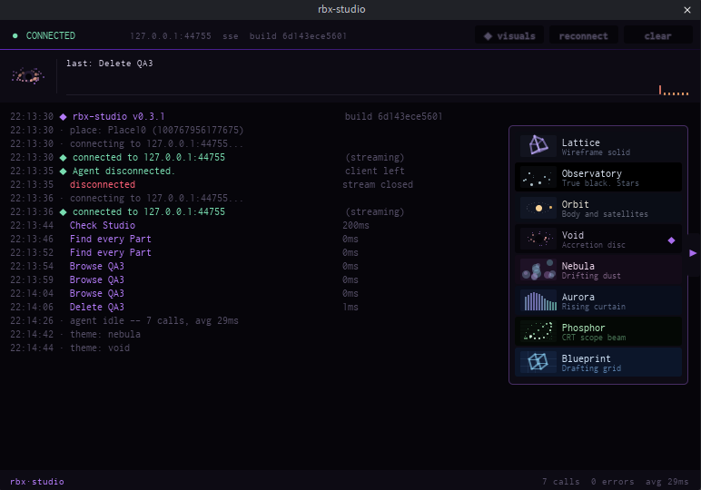

# Roblox Studio MCP

Let an AI agent drive Roblox Studio: read your place, edit scripts, build geometry, run playtests, take screenshots. 31 tools. MIT.



## Install

**1. The plugin**

```bash
npx -y @el4cteo/rbx-studio-mcp --install-plugin
```

**2. The server**

```bash
claude mcp add roblox-studio -- npx -y @el4cteo/rbx-studio-mcp
```

<details>
<summary>Other clients</summary>

Codex CLI:

```bash
codex mcp add roblox-studio -- npx -y @el4cteo/rbx-studio-mcp
```

Cursor, Claude Desktop, Gemini CLI, Windsurf — add to their config file:

```json
{
  "mcpServers": {
    "roblox-studio": {
      "command": "npx",
      "args": ["-y", "@el4cteo/rbx-studio-mcp"]
    }
  }
}
```

VS Code / Copilot (`.vscode/mcp.json`) uses `"servers"` instead of `"mcpServers"`, plus `"type": "stdio"`.

opencode (`opencode.json`):

```json
{
  "mcp": {
    "roblox-studio": {
      "type": "local",
      "command": ["npx", "-y", "@el4cteo/rbx-studio-mcp"],
      "enabled": true
    }
  }
}
```
</details>

**3.** Open Studio and accept the `127.0.0.1` prompt. Check it works with `studio_status`.

Something wrong? Run `npx -y @el4cteo/rbx-studio-mcp doctor` — it says what is broken and how to fix it.

Port is **44755**, loopback only. Change it with `--port` and match it in the plugin.

Only `debug` needs anything extra: **Debugger Luau API** in File → Beta Features, then restart Studio.

## Tools

| | |
|---|---|
| **Session** | `studio_status` `list_studios` `set_active_studio` |
| **Discover** | `tree` `inspect` `find` `api` |
| **Scripts** | `script_read` `script_edit` `script_grep` `script_create` |
| **Instances** | `create` `modify` `delete` `move` |
| **World** | `geometry` `terrain` `generate` `assets` `collision` `undo` |
| **Run & debug** | `playtest` `execute_luau` `character` `input` `console` `debug` `performance` |
| **Look** | `screenshot` `viewport` `device` |

Write tools take arrays — ten script edits is one call, one **Ctrl+Z**, and all-or-nothing.

Two things to watch: a playtest connects a second session, so pass `studioId` and use the edit one for changes that must last; `device` emulation stays on until `device op="stop"`.

## The console panel

Every call is logged with how long it took. Below the header is a command line — type a command, or type a sentence and a coding agent answers it.

| | |
|---|---|
| `help` | list everything |
| `doctor` | check the setup |
| `status` `version` `place` `clients` | what this session is |
| `studios` `use <n>` | which Studio window calls go to |
| `theme [name]` `visuals` `log [level]` `clear` `copy` | the panel |
| `port [n]` `reconnect` | the connection |
| `agent [use <id>\|new]` `stop` | which agent runs your prompts |
| anything else | sent to that agent |

Arrows walk the history, Tab completes.

**Prompts start a real agent** — whichever you have on PATH: Claude Code, Codex, opencode, Gemini, Cursor, Amp, Qwen Code, Factory Droid, goose, Copilot CLI, Aider, Crush, DeepSeek Harness. It runs headless, drives the same Studio, and its work appears in the log. It is a separate session from your terminal, billed separately, and allowed the `rbx-studio` tools only. `stop` cancels it.

Eight themes behind the tab on the right edge. Your pick is remembered.

## Why this one

- **Push, not poll** — 13.6 ms per call against 25.8 ms.
- **Safe script edits** — writes go through the script editor, so unsaved work survives.
- **Stale edits are refused** — pass back the `rev` from `script_read` and a write lands only if nobody else touched the file.
- **Property names are checked** against the running engine, so `Anchorred` comes back as a suggestion, not a runtime error.

## DeepSeek Harness (dsh)

This server registers as a dsh plugin. `config/dsh.cordis.yml` is the row:

```sh
dsh --profile headless --patch config/dsh.cordis.yml "add a spawn point"
```

To keep it, append that row to your own `cordis.patch.yml`. Needs `DEEPSEEK_API_KEY`.

## Security

Loopback only, and requires a header a browser cannot set cross-origin. Your experience's "Allow HTTP Requests" setting is untouched.

## Development

```bash
npm install
npm run build          # TypeScript -> dist/
npm run install:plugin # build the plugin and copy it into Studio
npm test
```

Needs `luau`, `luau-compile` and `luau-analyze` from [the Luau releases](https://github.com/luau-lang/luau/releases) on `PATH` or in `tools/`.

## Licence

MIT.
