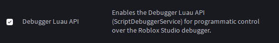

# Roblox Studio MCP

MCP server for Roblox Studio: 29 tools over a push-based bridge, batched writes that undo as one step, editor-safe script edits. MIT.


## Install

**1. The Studio plugin**

```bash
npx -y @el4cteo/rbx-studio-mcp --install-plugin
```

Or download `StudioMCP.rbxmx` from [Releases](https://github.com/EL4CTEO/rbx-studio-mcp/releases) into your Studio plugins folder.

**2. The server**, in whichever client you use:

<details>
<summary><b>Claude Code</b></summary>

```bash
claude mcp add roblox-studio -- npx -y @el4cteo/rbx-studio-mcp
```
</details>

<details>
<summary><b>Codex CLI</b></summary>

```bash
codex mcp add roblox-studio -- npx -y @el4cteo/rbx-studio-mcp
```
</details>

<details>
<summary><b>Cursor</b> — <code>~/.cursor/mcp.json</code> or <code>.cursor/mcp.json</code></summary>

```json
{
  "mcpServers": {
    "roblox-studio": {
      "command": "npx",
      "args": ["-y", "@el4cteo/rbx-studio-mcp"]
    }
  }
}
```
</details>

<details>
<summary><b>Claude Desktop</b> — <code>claude_desktop_config.json</code></summary>

```json
{
  "mcpServers": {
    "roblox-studio": {
      "command": "npx",
      "args": ["-y", "@el4cteo/rbx-studio-mcp"]
    }
  }
}
```
</details>

<details>
<summary><b>Gemini CLI</b> — <code>~/.gemini/settings.json</code></summary>

```json
{
  "mcpServers": {
    "roblox-studio": {
      "command": "npx",
      "args": ["-y", "@el4cteo/rbx-studio-mcp"]
    }
  }
}
```
</details>

<details>
<summary><b>Windsurf</b> — <code>~/.codeium/windsurf/mcp_config.json</code></summary>

```json
{
  "mcpServers": {
    "roblox-studio": {
      "command": "npx",
      "args": ["-y", "@el4cteo/rbx-studio-mcp"]
    }
  }
}
```
</details>

<details>
<summary><b>VS Code / Copilot</b> — <code>.vscode/mcp.json</code></summary>

```json
{
  "servers": {
    "roblox-studio": {
      "type": "stdio",
      "command": "npx",
      "args": ["-y", "@el4cteo/rbx-studio-mcp"]
    }
  }
}
```
</details>

<details>
<summary><b>opencode</b> — <code>opencode.json</code></summary>

```json
{
  "$schema": "https://opencode.ai/config.json",
  "mcp": {
    "roblox-studio": {
      "type": "local",
      "command": ["npx", "-y", "@el4cteo/rbx-studio-mcp"],
      "enabled": true
    }
  }
}
```
</details>

**3.** Open Studio and accept the `127.0.0.1` prompt — the plugin connects automatically. Verify with `studio_status`.

**4.** `debug` additionally needs **Debugger Luau API** in File → Beta Features, plus a Studio restart. Nothing else requires it.



Port defaults to **44755** — change with `--port` or `ROBLOX_STUDIO_MCP_PORT`, and match it in the plugin widget. Loopback only.

## Multiple agents

Register the server in as many clients as you like — the plugin connects out to one port, the first server owns it and the rest proxy through. No configuration, no second Studio connection.

Each agent keeps its own target (`set_active_studio` is per client), so two agents can work on two open places and neither can retarget the other. Pass `studioId` on a single call to reach elsewhere without changing your default.

Subagents share their parent's connection and therefore its target — a subagent calling `set_active_studio` silently retargets its parent. Give subagents an explicit `studioId` per call.

## Tools

| | |
|---|---|
| **Session** | `studio_status` `list_studios` `set_active_studio` |
| **Discover** | `tree` `inspect` `find` `api` |
| **Scripts** | `script_read` `script_edit` `script_grep` `script_create` |
| **Instances** | `create` `modify` `delete` `move` |
| **World** | `geometry` `assets` `collision` `undo` |
| **Run & debug** | `playtest` `execute_luau` `character` `input` `console` `debug` `performance` |
| **Look** | `screenshot` `viewport` `device` |

Gotchas: during a playtest two sessions connect — pass `studioId` explicitly and use the edit session for anything that must persist. `device` emulation persists until `device op="stop"`.

## Batching

Every write tool takes an array — ten script edits or two hundred deletions is one call.

| tool | takes | cap |
|---|---|---|
| `create` | instances, each nesting `children` to any depth | 100 |
| `modify` | entries, each with an unlimited list of `paths` | 100 entries |
| `delete` | paths | 200 |
| `move` | moves | 200 |
| `script_edit` | edits, across any number of scripts | 50 |
| `script_create` | scripts | 50 |
| `inspect` | paths | 50 |
| `input` | input steps, delivered in order | 40 |

`modify` caps *entries*, not targets — one entry can anchor five hundred parts, so pair it with `find` to change a whole place in one call.

Each batch is a single `ChangeHistoryService` recording: **one Ctrl+Z**. Batches are all-or-nothing — everything is transformed in memory first, so a failed match leaves the place untouched.

Parallel tool calls also work (responses are keyed by request id), but prefer a batch: N parallel calls are N round trips and N undo steps, a batch is one of each.

## Compared to what else exists

| | tools | transport | editor-safe writes | undo recording | live API dump | licence |
|---|---|---|---|---|---|---|
| **this** | 29 | **SSE push** | **yes** | **yes** | **yes** | MIT |
| [Roblox built-in](https://create.roblox.com/docs/studio/mcp) | ~27 | stdio | partial | — | n/a | closed source |
| [Chrrxs](https://github.com/Chrrxs/robloxstudio-mcp) | ~40 | poll | no | partial | no | MIT |
| [drgost1](https://github.com/drgost1/robloxstudio-mcp) | 51 | poll 500 ms | no | yes | no | MIT |
| [boshyxd](https://github.com/boshyxd/robloxstudio-mcp) | 43 | long-poll | no | no | no | MIT (archived) |
| [Roblox/studio-rust-mcp-server](https://github.com/Roblox/studio-rust-mcp-server) | 2 | HTTP | no | no | no | MIT (superseded) |

- **Push, not poll** — 50 sequential round trips: 13.6 ms mean vs 25.8 ms, 12.8 ms median vs 29.9 ms (`node scripts/latency.mjs --count 50 --compare`).
- **Safe script edits** — `ScriptEditorService:UpdateSourceAsync`, not `script.Source`; your unsaved editor buffer survives.
- **~16k tokens of schema** against 43–51 tools elsewhere. Cursor-paged, capped, `detail: concise | standard | full`.
- **Live API dump** — property typos get suggestions (`Anchorred` → `Anchored`).

Not built here: terrain, AI mesh and material generation.

## Security

Binds `127.0.0.1`, rejects `Origin`, and requires a header a browser cannot set cross-origin — closing the DNS-rebinding hole. HTTP permission is granted per plugin and per URL, so your experience's "Allow HTTP Requests" setting is untouched.

## Development

```bash
npm install
npm run build          # TypeScript -> dist/
npm run build:plugin   # plugin/src -> build/StudioMCP.rbxmx
npm run install:plugin # build + copy into the Studio plugins folder
npm test               # plugin (Luau) + bridge (Node) tests
```

Needs `luau`, `luau-compile` and `luau-analyze` from [the Luau releases](https://github.com/luau-lang/luau/releases) on `PATH` or in `tools/`.

`evals/` holds ten questions answerable only by driving a real Studio session — see [evals/README.md](evals/README.md).

## Licence

MIT.
