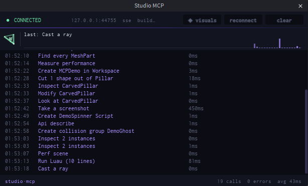

# Roblox Studio MCP

MCP server for Roblox Studio. 29 tools over a push-based bridge, every write batched and undoable in one step. MIT.



## Install

**1. The Studio plugin**

```bash
npx -y @el4cteo/rbx-studio-mcp --install-plugin
```

Or download `StudioMCP.rbxmx` from [Releases](https://github.com/EL4CTEO/rbx-studio-mcp/releases) into your Studio plugins folder.

**2. The server**, in whichever client you use:

<details>
<summary><b>Claude Code</b></summary>

```bash
claude mcp add roblox-studio -- npx -y @el4cteo/rbx-studio-mcp
```
</details>

<details>
<summary><b>Codex CLI</b></summary>

```bash
codex mcp add roblox-studio -- npx -y @el4cteo/rbx-studio-mcp
```

Or in `~/.codex/config.toml`:

```toml
[mcp_servers.roblox-studio]
command = "npx"
args = ["-y", "@el4cteo/rbx-studio-mcp"]
```
</details>

<details>
<summary><b>Cursor</b></summary>

`~/.cursor/mcp.json` (global) or `.cursor/mcp.json` (per project):

```json
{
  "mcpServers": {
    "roblox-studio": {
      "command": "npx",
      "args": ["-y", "@el4cteo/rbx-studio-mcp"]
    }
  }
}
```
</details>

<details>
<summary><b>opencode</b></summary>

`opencode.json`:

```json
{
  "$schema": "https://opencode.ai/config.json",
  "mcp": {
    "roblox-studio": {
      "type": "local",
      "command": ["npx", "-y", "@el4cteo/rbx-studio-mcp"],
      "enabled": true
    }
  }
}
```
</details>

<details>
<summary><b>Claude Desktop</b></summary>

`claude_desktop_config.json`:

```json
{
  "mcpServers": {
    "roblox-studio": {
      "command": "npx",
      "args": ["-y", "@el4cteo/rbx-studio-mcp"]
    }
  }
}
```
</details>

<details>
<summary><b>VS Code / Copilot</b></summary>

`.vscode/mcp.json`:

```json
{
  "servers": {
    "roblox-studio": {
      "type": "stdio",
      "command": "npx",
      "args": ["-y", "@el4cteo/rbx-studio-mcp"]
    }
  }
}
```
</details>

<details>
<summary><b>Gemini CLI</b></summary>

`~/.gemini/settings.json`:

```json
{
  "mcpServers": {
    "roblox-studio": {
      "command": "npx",
      "args": ["-y", "@el4cteo/rbx-studio-mcp"]
    }
  }
}
```
</details>

<details>
<summary><b>Windsurf</b></summary>

`~/.codeium/windsurf/mcp_config.json`:

```json
{
  "mcpServers": {
    "roblox-studio": {
      "command": "npx",
      "args": ["-y", "@el4cteo/rbx-studio-mcp"]
    }
  }
}
```
</details>

**3.** Open Studio, accept the `127.0.0.1` prompt, check the **Studio MCP** toolbar button. Verify with `studio_status`.

Port defaults to **44755** — `--port` or `ROBLOX_STUDIO_MCP_PORT`, matched in the plugin widget. Loopback only.

**Several agents at once work.** Register this in as many clients as you like — two Claude sessions, Claude plus Cursor, whatever. The plugin connects out to one port, so the first server to start owns it and the rest proxy through it automatically. Nothing to configure, and no second connection to Studio.

## Tools

| | |
|---|---|
| **Discover** | `studio_status` `tree` `inspect` `find` `api` |
| **Scripts** | `script_read` `script_edit` `script_grep` `script_create` |
| **Instances** | `create` `modify` `delete` `move` |
| **World** | `geometry` `assets` `collision` `undo` |
| **Run & debug** | `playtest` `execute_luau` `character` `input` `console` `debug` `performance` |
| **Look** | `screenshot` `viewport` `device` |
| **Session** | `list_studios` `set_active_studio` |

Gotchas: `debug` needs **API debugger Luau** in `File → Beta Features`. `device` emulation persists until `device op="stop"`. During a playtest two sessions connect — pass `studioId` explicitly, using the edit session for anything that must persist.

## Batching

Every write tool takes an array. Editing ten scripts, deleting two hundred
parts or anchoring a whole map is **one call**, not a loop.

| tool | takes | cap |
|---|---|---|
| `create` | instances, each nesting `children` to any depth | 100 |
| `modify` | entries, each with an unlimited list of `paths` | 100 entries |
| `delete` | paths | 200 |
| `move` | moves | 200 |
| `script_edit` | edits, across any number of scripts | 50 |
| `script_create` | scripts | 50 |
| `inspect` | paths | 50 |
| `input` | input steps, delivered in order | 40 |

The cap on `modify` is on *entries*, not targets — one entry can anchor five
hundred parts, so pair it with `find` and change a whole place in a single call.

What that buys beyond speed:

- **One Ctrl+Z.** The batch runs inside a single `ChangeHistoryService`
  recording named after the tool. Ten script edits undo as one step, not ten.
- **All-or-nothing.** Everything is read and transformed in memory before
  anything is written, so a find that matches nothing — or matches twice —
  fails with the place untouched instead of half-edited.
- **Nesting.** `create` takes `children`, so a whole model arrives in one call.
  A new instance's path is not knowable until it exists, and same-named siblings
  make guessing it unreliable.

Parallel tool calls work too — responses are keyed by request id, so several
calls in one turn run concurrently. Prefer a batch where one exists: parallel
calls are N round trips and N undo steps, a batch is one of each.

## Compared to what else exists

| | tools | transport | editor-safe writes | undo recording | live API dump | licence |
|---|---|---|---|---|---|---|
| **this** | 29 | **SSE push** | **yes** | **yes** | **yes** | MIT |
| [Roblox built-in](https://create.roblox.com/docs/studio/mcp) | ~27 | stdio | partial | — | n/a | closed source |
| [Chrrxs](https://github.com/Chrrxs/robloxstudio-mcp) | ~40 | poll | no | partial | no | MIT |
| [drgost1](https://github.com/drgost1/robloxstudio-mcp) | 51 | poll 500 ms | no | yes | no | MIT |
| [boshyxd](https://github.com/boshyxd/robloxstudio-mcp) | 43 | long-poll | no | no | no | MIT (archived) |
| [Roblox/studio-rust-mcp-server](https://github.com/Roblox/studio-rust-mcp-server) | 2 | HTTP | no | no | no | MIT (superseded) |

- **Push, not poll.** SSE stream instead of a 500 ms poll. 50 sequential round trips: **13.6 ms** mean vs 25.8 ms, **12.8 ms** median vs 29.9 ms. Reproduce with `node scripts/latency.mjs --count 50 --compare`.
- **Safe script edits.** `ScriptEditorService:UpdateSourceAsync`, not `script.Source` — your unsaved editor buffer survives.
- **One Ctrl+Z per action**, via `ChangeHistoryService`.
- **29 tools, ~16k tokens of schema**, against 43–51 elsewhere. Cursor-paged, capped, with `detail: concise | standard | full`.
- **Live API dump** for property validation, so typos get suggestions (`Anchorred` → `Anchored`).

Not built here: terrain, AI mesh and material generation.

## Security

Binds `127.0.0.1`, rejects requests carrying `Origin`, and requires a header a browser cannot set cross-origin — closing the DNS-rebinding hole. Studio grants HTTP per plugin and per URL, so your experience's "Allow HTTP Requests" setting is untouched.

## Development

```bash
npm install
npm run build          # TypeScript -> dist/
npm run build:plugin   # plugin/src -> build/StudioMCP.rbxmx
npm run install:plugin # build + copy into the Studio plugins folder
npm test               # Luau unit tests
```

Needs `luau`, `luau-compile` and `luau-analyze` from [the Luau releases](https://github.com/luau-lang/luau/releases) on `PATH` or in `tools/`.

`evals/` holds ten questions answerable only by driving a real Studio session — see [evals/README.md](evals/README.md).

## Licence

MIT.
