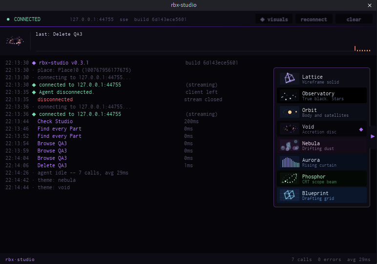

# Roblox Studio MCP

Let an AI agent drive Roblox Studio: read your place, edit scripts, build geometry, run playtests, take screenshots. 35 tools. MIT.



## Install

**1. The plugin**

```bash
npx -y @el4cteo/rbx-studio-mcp --install-plugin
```

Or drop `StudioMCP.rbxmx` from [Releases](https://github.com/EL4CTEO/rbx-studio-mcp/releases) into your Studio plugins folder.

**2. The server**

```bash
claude mcp add roblox-studio -- npx -y @el4cteo/rbx-studio-mcp
```

<details>
<summary>Other clients</summary>

Codex CLI:

```bash
codex mcp add roblox-studio -- npx -y @el4cteo/rbx-studio-mcp
```

Cursor, Claude Desktop, Gemini CLI, Windsurf — add to their config file:

```json
{
  "mcpServers": {
    "roblox-studio": {
      "command": "npx",
      "args": ["-y", "@el4cteo/rbx-studio-mcp"]
    }
  }
}
```

VS Code / Copilot (`.vscode/mcp.json`) uses `"servers"` instead of `"mcpServers"`, plus `"type": "stdio"`.

opencode (`opencode.json`):

```json
{
  "mcp": {
    "roblox-studio": {
      "type": "local",
      "command": ["npx", "-y", "@el4cteo/rbx-studio-mcp"],
      "enabled": true
    }
  }
}
```
</details>

**3.** Open Studio and accept the `127.0.0.1` prompt. Check it works with `studio_status`.

Something wrong? Run `npx -y @el4cteo/rbx-studio-mcp doctor` — it says what is broken and how to fix it.

Port is **44755**, loopback only. Change it with `--port` and match it in the plugin.

## Tools

| | |
|---|---|
| **Session** | `studio_status` `list_studios` `set_active_studio` |
| **Discover** | `tree` `inspect` `find` `api` |
| **Scripts** | `script_read` `script_edit` `script_grep` `script_create` `sync` |
| **Instances** | `create` `modify` `delete` `move` |
| **World** | `geometry` `terrain` `generate` `assets` `collision` `audio` `undo` |
| **Data & live game** | `datastore` `universe` |
| **Run & debug** | `playtest` `execute_luau` `character` `input` `console` `debug` `performance` |
| **Look** | `screenshot` `viewport` `device` |

Write tools take arrays — ten script edits is one call, one **Ctrl+Z**, and all-or-nothing.

## Inspect the running client

Use the playtest server's `studioId` returned by `playtest`. The existing readers can now run in the actual player's VM:

```
tree target="client" path="Players.Alice.PlayerGui" handles=true
inspect target="client" paths=["<handle>"] properties=["Text","AbsoluteSize"]
find target="client" className="TextButton" properties=["Text"]
viewport op="ui" target="client"
performance op="snapshot" target="client"
```

Add `player="Alice"` when several players are present. `target="studio"` keeps the selected Studio session's existing behavior. Client handles belong to that player and runtime; use the same target, player and session in later calls.

`handles=true` adds an in-memory reference alongside an instance's path. It survives rename/reparent and can replace a path in existing tools. Deleted, expired or wrong-context handles fail instead of resolving to a different object. Each VM keeps at most 5,000 references; query again after eviction or a new playtest. No handle attributes are written into the place.

`screenshot path=` also resolves client-only GUI and world instances during a playtest. `viewport op="pick" x=0.5 y=0.5 target="client"` returns the world geometry under the actual camera's center, with a handle. Coordinates are normalized over the **full uncropped viewport**, not a cropped screenshot; use the screenshot caption's crop and scale to map pixels back.

`debug op="watch" path=... target="client" properties=["Text"] attributes=["State"] seconds=5` records initial values and timestamped property, attribute and direct-child changes. Omit `attributes` to watch all, or pass `[]` for none. It waits for a bounded 1–15-second window, so send input or another execution concurrently. Connections are removed afterwards. Replies retain at most 100 events and 10 KB of initial/event data, with explicit drop counts. Signals can coalesce rapid writes; this is not writer attribution or continuous physics sampling.

## Recover an execution result

When a successful `execute_luau` preview is clipped, it returns a `resultId`. Retrieve pages with the **source omitted**; the original script is never rerun:

```
execute_luau resultId="<id>" resultOffset=0 resultLimit=25 resultFields=["name","value"]
execute_luau resultId="<id>" resultPath=["returned",1,"nested"]
```

Keep the original `target`, `player` and `studioId`. The default path is `["returned",1]`; `[]` selects the snapshot root. Table entries include keys, and `nextOffset` continues the page. Oversized nested values provide their own `resultPath`. String pages use UTF-8 byte offsets and join into the original string, including a returned JSON string.

Retention is bounded: 8 snapshots per VM, 120 seconds, 128 KiB per snapshot, depth 16 and 10,000 nodes. `retainedTruncated` and `omittedPaths` say when retention itself lost data; a continuation cannot recover data beyond those caps.

Printed output separately keeps at most 200 lines/128 KiB before snapshot copying. `outputNotRetained` reports lines that could not be kept, including an oversized first line. Very long result addresses can exceed the page budget and produce an explicit error rather than a repeating cursor.

See the [v0.9.0 scope review](docs/v0.9.0-review.md) for the tradeoffs.

## Work on files

`sync` mirrors your scripts into a folder, so an agent can edit code with its own file tools and use Studio to test.

```
sync op="pull"      # Studio -> ./studio
sync op="push"      # ./studio -> Studio
sync op="watch"     # both ways, live, until op="stop"
```

- Rojo-style layout: `Main.server.luau`, `.client.luau`, `.luau`; a script with children is a folder with `init`. A `sourcemap.json` is written for luau-lsp.
- Rename or move a file and the script moves with it, keeping its attributes and references.
- Edited on both sides? It's a conflict and neither side is touched. Studio's version waits in `.rbx-sync/conflicts/`; merge into the file and sync again, or pass `prefer: "studio"` / `"disk"`.
- Deleting a file deletes the script (one Ctrl+Z). A script deleted in Studio sends its file to `.rbx-sync/trash`.
- `export` writes UI or any instance tree as a `.build.json` file; edit it and `build` rebuilds it, keeping its scripts. Edits made in Studio flow back into the file.
- `watch` only works when something changes: about 0.5s each way, even with 2,000 scripts. Conflicts show up in the agent's next reply.

## Open Cloud

Some calls reach past Studio to Roblox itself. All need one API key; everything else works without it.

| | |
|---|---|
| `assets op="upload"` | send a local audio/image/model/video file, get an asset id |
| `datastore target="live"` | the running game's real player data |
| `execute_luau target="live"` | run a script on the published place |
| `universe` | restart servers, message them, ban players, read server logs, sell products and passes, read analytics, schedule events |
| also | `assets op="grant"`, `op="publish"`, `script_read`/`script_edit target="live"` |

Make a key at [Creator Dashboard → Credentials](https://create.roblox.com/dashboard/credentials), adding the permissions you want: `assets`, `universe-datastores`, `ordered-data-stores`, `luau-execution-sessions`, `universe-places`, `universe-place-instances`, `universe`, `messaging-service`, `user-restrictions`, `inventory`, `users`, `asset-permissions`, `developer-products`, `game-passes`, `universe-analytics`. Scheduling events needs the `universe.event:read` and `:write` permissions.

Then in the Studio panel:

```
cloud key <paste>
cloud user <your user id>
cloud place <place id>
```

`cloud place` works out the universe for you. The typed key is masked in the log and in the history, and stored at `~/.rbx-studio-mcp/credentials.json` (mode 0600) — never in the place file, never in the conversation. `cloud` shows what is set, `cloud test` re-checks it, `cloud forget` deletes it. `ROBLOX_API_KEY` and friends in the environment work too and take priority.

Two things to watch: a playtest connects a second session, so pass `studioId` and use the edit one for changes that must last; `device` emulation stays on until `device op="stop"`.

## The console panel

Every call is logged with how long it took. At the foot of the panel is a command line. Type a command — or run `chat on` and type a sentence to have a coding agent answer it.

| | |
|---|---|
| `help` | list everything |
| `doctor` | check the setup |
| `status` `version` `place` `clients` | what this session is |
| `studios` `use <n>` | which Studio window calls go to |
| `theme [name]` `visuals` `autoopen [on\|off]` `log [level]` `clear` `copy` | the panel |
| `port [n]` `reconnect` | the connection |
| `cloud [key\|user\|group\|test\|forget]` | the Open Cloud key `upload` uses |
| `chat [on\|off]` | let an agent answer sentences (off by default) |
| `agent [use <id>\|new]` `stop` | which agent runs your prompts |
| anything else | sent to that agent, once `chat` is on |

Click the bar and every command is listed with what it does. Keep typing to filter, scroll for the rest, click one to fill it in.

**With `chat on`, prompts start a real agent** — whichever you have on PATH: Claude Code, Codex, opencode, Gemini, Cursor, Amp, Qwen Code, Factory Droid, goose, Copilot CLI, Aider, Crush, DeepSeek Harness. It runs headless, drives the same Studio, and its work appears in the log. It is a separate session from your terminal, billed separately, and allowed the `rbx-studio` tools only. `stop` cancels it.

Eight themes behind the tab on the right edge. Your pick is remembered.

## Why this one

- **Push, not poll** — 13.6 ms per call against 25.8 ms.
- **Safe script edits** — writes go through the script editor, so unsaved work survives.
- **Stale edits are refused** — pass back the `rev` from `script_read` and a write lands only if nobody else touched the file.
- **Property names are checked** against the running engine, so `Anchorred` comes back as a suggestion, not a runtime error.

## DeepSeek Harness (dsh)

This server registers as a dsh plugin. Append this row to `$DSH_HOME/cordis.patch.yml`,
or to `$DSH_HOME/profiles/<name>/cordis.patch.yml` for one profile only:

```yaml
- insert:
    - id: mcp-rbx-studio
      name: '@deepseek-ai/dsh-mcp-client'
      config:
        serverName: rbx-studio
        transport: stdio
        command: npx
        args: ['-y', '@el4cteo/rbx-studio-mcp']
        cwd: !!js process.cwd()
```

Then `dsh --profile headless "what is in workspace"`. Needs `DEEPSEEK_API_KEY`.
The same row, commented, is in `config/dsh.cordis.yml` for use with `dsh --patch`.

## Security

Loopback only. Requests need a header a browser cannot set cross-origin and a loopback `Host`, so a web page cannot reach it, even through DNS rebinding. Your experience's "Allow HTTP Requests" setting is untouched.

## Development

```bash
npm install
npm run build          # TypeScript -> dist/
npm run install:plugin # build the plugin and copy it into Studio
npm test
```

Needs `luau`, `luau-compile` and `luau-analyze` from [the Luau releases](https://github.com/luau-lang/luau/releases) on `PATH` or in `tools/`.

With Studio open and the plugin loaded, `node scripts/test-live.mjs` checks the transport and `node scripts/test-live-tools.mjs [--playtest]` runs every tool, `node scripts/test-live-sync.mjs` checks `sync`, and `node scripts/test-live-sync-scale.mjs` times it on 2,000 scripts. All clean up after themselves.

## Licence

MIT.
